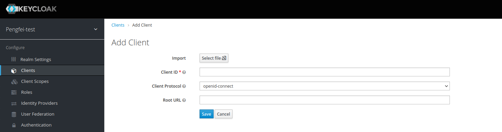
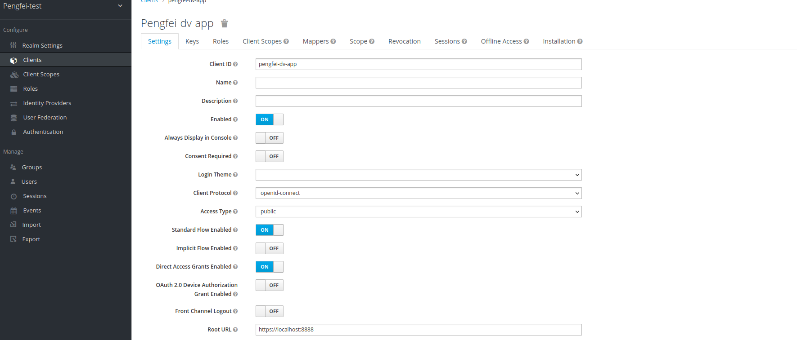
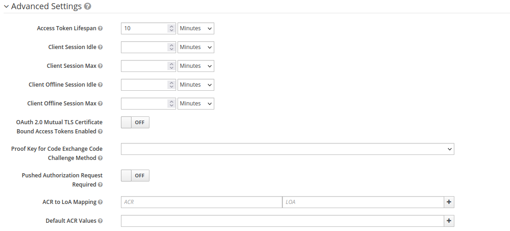
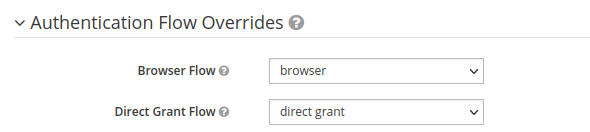
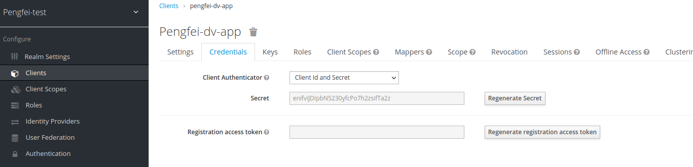

# Install keycloak

The official doc is [here](https://www.keycloak.org/getting-started/getting-started-zip)

## Step1. Install jdk 11

I recommend you to use sdkman. Run below command to install sdkman

```shell
curl -s "https://get.sdkman.io" | bash

# this should install sdkman in your home folder. For instance, mine is installed under
/home/pliu/.sdkman
```

Install openjdk, note sdkman provides many different distribution of jdk. You can choose one that suit you the most

The full usage doc of sdkman is [here](https://sdkman.io/usage)
```shell
# list all available jdk distribution
sdk list java

# install openjdk 11
sdk install java 11.0.12-open 
```

Set the java home in your system path.

```shell
# create a profile for loading java home
sudo vim /etc/profile.d/java.sh

# put below lines in it, note you need to change the sdkman path to yours
# note in candidates/java/, you will find all installed jdk version. But we don't recommend
# you to put a fix version number in the path. Because you have to change the JAVA_HOME path if you want to
# switch to another java version. 
# 
# Use current in JAVA_HOME.  
export JAVA_HOME=/home/pliu/.sdkman/candidates/java/current
export PATH=$PATH:$JAVA_HOME/bin

```

If you want to change java version, you need to do below command:

```shell
sdk default java <new-version>
# for example below command will change current java home to openjdk 8
sdk default java 8.0.302-open
```

Test your jdk installation

```shell
java -version
openjdk version "11.0.12" 2021-07-20
OpenJDK Runtime Environment 18.9 (build 11.0.12+7)
OpenJDK 64-Bit Server VM 18.9 (build 11.0.12+7, mixed mode)

echo $JAVA_HOME
/home/pliu/.sdkman/candidates/java/11.0.12-open

```

## Step 2 Install keycloak

Download source from this page(https://www.keycloak.org/downloads).

For my instance, I download version [18.0.0](https://github.com/keycloak/keycloak/releases/download/18.0.0/keycloak-18.0.0.zip)

Unzip it and put it somewhere.

## Step3 Run the keycloak in dev mode

**This is dev mode, don't do this for your production.**

```shell
cd /path/to/keycloak

bin/kc.sh start-dev
```

## Step 4 Create an admin user

Keycloak does not come with a default admin user, which means before you can start using Keycloak you need to create an admin user.

To do this open http://localhost:8080/, then fill in the form with your preferred username and password.

For example admin:admin (don't do this for your prod)

## Step 5. Login to the admin console

Go to the Keycloak Admin Console and login with the username and password you created earlier.


## Step 6. Create a realm

A realm in Keycloak is the equivalent of a tenant. It allows creating isolated groups of applications and users. 
By default there is a single realm in Keycloak called master. This is dedicated to manage Keycloak and should not be 
used for your own applications.

Let’s create our first realm. Open the Keycloak Admin Console

1. Hover the mouse over the dropdown in the top-left corner where it says Master, then click on Add realm

2. Fill in the form with the following values:

        Name: pengfei-test

3. Click Create


## Step 7. Create a user

Initially there are no users in a new realm, so let’s create one: Open the Keycloak Admin Console

1. Click Users (left-hand menu). Then Click Add user (top-right corner of table)

2. Fill in the form with the following values:

    - Username: pengfei

    - First Name: toto

    - Last Name: toto

3. Click Save

## Step 8. Setup initial password for user

1. Click Credentials (top of the page)

2. Fill in the Set Password form with a password

3. Click ON next to Temporary to prevent having to update password on first login

toto:toto

## Step 9. Login to account console

Let’s now try to login to the account console to verify the user is configured correctly.

1. Open the Keycloak Account Console(http://localhost:8080/realms/pengfei-test/account/#/)

2. Login with `pengfei` and the password you created earlier

You should now be logged-in to the account console where users can manage their accounts.

## Step 10. Secure your first app

To secure an application, we need to create a specific client in our realm, as shown in below Figure. 


**A client in Keycloak represents a resource that particular users can access, whether for authenticating a user, 
requesting identity information, or validating an access token.**

Follow below step to register a new client :

1. Open the Keycloak Admin Console (http://localhost:8080/admin/master/console/)

2. Click 'Clients'

3. Fill in the form with the following values:

    - Client ID: pengfei-dv-app

    - Client Protocol: openid-connect

    - Root URL: https://localhost:8888

4. Click Save

Now you should see a more detailed form as shown in below figure.



- Change **Access Type**: set its value to **confidential**.

- **Advance settings**: Set access token lifeSpan 



- **Authentication flow overrides**: set `Direct Grant Flow` value to **direct grant**.



- update the client's credentials: Use **Client Id and Secret** for `Client Authenticator field`.



## Step 11. Test the created client

Note there is modification for the endpoint that generate the JWT token. 

```text
# For keycloak >= 17.0. The new endpoint is:
https://$HOSTNAME/realms/$REALM_NAME/protocol/openid-connect/token

# For keycloak < 17.0. The legacy endpoint is
https://$HOSTNAME/auth/realms/$REALM_NAME/protocol/openid-connect/token
```

Now we can test our newly created client through the REST API to simulate a simple login. Base on your keycloak version,
the authentication URL could be in below form:

```text
# Before 17.0
http://localhost:8080/auth/realms/pengfei-test/protocol/openid-connect/token

# Since 17.0
http://localhost:8080/realms/pengfei-test/protocol/openid-connect/token
```

Fill out the parameters and set our **client_id** and **client_secret** with our **username** and **password**:

In our case,
client_id=pengfei-dv-app
client_secret=enifviJDIpbN5230yfcPo7h2zsifTa2z
username=pengfei
password=toto

```shell
curl -L -X POST 'http://localhost:8080/auth/realms/pengfei-test/protocol/openid-connect/token' \
-H 'Content-Type: application/x-www-form-urlencoded' \
--data-urlencode 'client_id=pengfei-dv-app' \
--data-urlencode 'grant_type=password' \
--data-urlencode 'client_secret=enifviJDIpbN5230yfcPo7h2zsifTa2z' \
--data-urlencode 'scope=openid' \
--data-urlencode 'username=pengfei' \
--data-urlencode 'password=toto'
```

Or you can check some example scripts in `../command`.